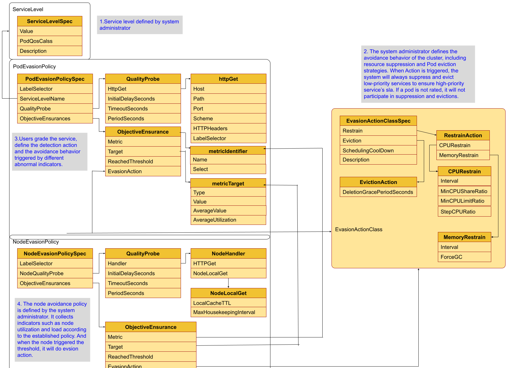

# Title
- Quality Probe And Ensurance API Introduction

## Table of Contents
- [Quality Probe And Ensurance API Introduction](#Quality Probe And Ensurance API Introduction)
  - [Table of Contents](#table-of-contents)
  - [Summary](#Summary)
  - [API Define](#API Definition)

## Summary

QosEnsurancePolicy model use active detect the quality  of the service and the load of the node to find the high level services's quality be effected.
If the high level service's quality be effected, we suppress and evict low level services to ensurance the high level service as far as possible. 

## API Definition
QosEnsurancePolicy model's api definition is show as the follow graph.

